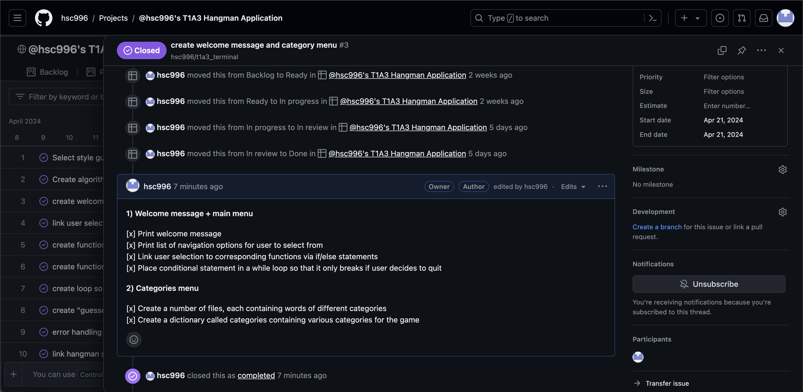

# T1A3 TERMINAL APPLICATION - Hangman Game


## LINKS


Github repository: https://github.com/hsc996/t1a3_terminal


Github Project board: https://github.com/users/hsc996/projects/3


## STYLE GUIDE: PEP8


#### _Imports:_
I've selected the PEP 8 style guide for python code, which I have adhered to throughout. According to the PEP8 styling guide, imports should be separated into 3 groups: standard library imports, related third party imports and local application imports. The style guide states that imports should be put "at the top of the file" and should be "on separate lines", making it easier to read and understand the dependencies of the script (Van Rossum et al., 2001). When viewing the code, one can see I have filed and labeled each import appropriately in accordance with these rules.


#### _Comments:_
I've used concise comments throughout to indicate the purpose of various classes, methods and functions. I've ensured they're all in complete sentences with the first word capitalized, as per the guidelines (Van Rossum et al., 2001). I've included these comments to enhance code readability and help other developers understand the logic of the code.


#### _Whitespaces:_
The code has consistent whitespace around operators and after commas, making it easier to read and understand. Furthermore, each method in the Hangman class is separated by a single blank line, as recommended by PEP 8 (Van Rossum et al., 2001).


#### _Indentation:_
As outlined by the PEP 8 guidelines, I've ensured that my code follows the standard indentation style of using four spaces per level.


#### _Variable names:_
Variable names are descriptive and follow the recommended naming conventions. For example, HANGMAN is in all caps, indicating it's a constant, and Hangman is in CamelCase, indicating it's a class name.


#### _Function and Method Names:_
All function and method names are descriptive, ensuring their functionality is clear to whomever is reading the code. Each function and method name adhere to the snake_case naming convention, which is the preferred convention outlined within the PEP 8 style guide (Van Rossum et al., 2001). For example, `main_menu()`, `game_help()`, and `game_start()`.


#### _String Formatting:_
I've used string formatting consistently throughout the code. For example, print(f"{Fore.RED}You've already guessed that letter!{Style.RESET}"). By consistently formatting all of the error messages in red, and the "CORRECT!" messages in green, I have improved readability of the code as well as for the player.


## FEATURES


#### _1) MAIN MENU_


As the application is run, the main_menu function is called, and the user is presented with a menu requesting them to [1] start game, [2] access help/instructions or [3] exit game. I've chosen to display this initial welcome message and menu script via a series of print("") statements. In order to ensure that the menu will remain on screen unless the user chooses to exit by selecting "3", I've utilised a while loop to serve as the primary control structure, as it will run indefinitely as long as its condition remains True. The user input is prompted and collected via an input function, which I've stored in the menu_choice variable. The input is then evaluated in a series of if-elif-else statements to determine the appropriate action based on the chosen option. The if/elif options point to 3 valid options for the user to choose, each calling the appropriate corresponding function to direct them to their option. Lastly, I've included the "else" statement to account for errors, so that rather than breaking the code by selecting an invalid option, an error message is displayed that prompts the user to try again.


#### _2) WORD SELECTION FROM CATEGORIES_


Once the user has selected to start the game, the `game_start()` function is called and a list of categories will be displayed: the categories I've selected are SPOOKY, GEOGRAPHY, VIDEO GAMES, MYTHOLOGY and CULINARY DELIGHTS. The function begins by defining a dictionary named categories, where the keys are numerical indices and the values are strings representing different categories (e.g., "SPOOKY", "GEOGRAPHY"). The function then iterates over the categories dictionary using a for loop, displaying each category along with its corresponding index number. I've printed both the categories and the header in coloured formatting for aesthetic purposes.


Just as I did in the `main_menu()` function, I've included a "while True" loop to encapsulate the if/else conditions to ensure that it will run indefinitely. Within the loop, it will then prompt the player to select their category using an input function that I've stored within the `category_choice()` variable. I've used the `int` function to convert the user input into an integer to avoid a TypeError. It then attempts to retrieve the selected category from the categories dictionary using `categories.get(category_choice)`. If the selected category is valid (i.e., exists in the dictionary), the loop continues; otherwise, an error message is displayed, prompting the player to select a valid category.


Once a valid category is selected, the function clears the terminal screen, prints a message confirming the selected category, and retrieves a random word from that category using the `get_random_word()` function. If the word retrieval is unsuccessful (i.e., word is None), an error message is displayed, and the loop continues to prompt the player to select a valid category. If a word is successfully retrieved, a new instance of the Hangman class is created with the selected word.


Within the game loop (`while not game.is_game_over()`), the player is prompted to guess a letter. The guessed letter is validated, and if it's valid, the game's guess method is called to process the guess. The game loop continues until the game is over (either the player wins or loses). If the game loop exits (either by winning, losing, or encountering an error), the outer while loop (while True) breaks, and the function execution ends.


#### _3) WIN/LOSE TRIGGER_


The `game_over()` method is responsible for triggering a final "game over" display at the end of the game, depending on the outcome. If the player corrects all the letters correctly within the frame of their allotted guesses, it will trigger a "YOU WON" display and if the player is unsuccessful, it will trigger a "YOU LOSE" display. This function is designed to work by calling the Hangman class: the 'guess' method takes the letter as input and converts the letter to uppercase for consistency. If there are no underscores left in self.`current_progress()`, it means the player has guessed all the letters correctly and won the game. If `self.guesses_left` becomes zero, it means the player has used all their chances and lost the game. In either case, the method prints a message informing the player of the outcome and resets the game. The game clears the terminal screen to keep the interface clean and readable after each guess. ASCII art representing the Hangman is displayed to provide a visual representation of the player's progress and the consequences of incorrect guesses.


#### _4) SCOREBOARD_


I've added a scoreboard feature to track the wins and losses of the player, including a date and time log of the outcome. Although a scoreboard traditionally involves a record of the players name and a system tracking "high scores", I've decided to simplify the scoreboard as this application is a single-player game. In order to create this feature, I had to first design a function that tracks the wins and losses by added them to a csv file: The `add_to_scoreboard()` function achieves this by taking a single parameter "won", which is a boolean indicating whether the game has been won or not. Inside the `try:` block of this function, it opens the `scoreboard.csv` file in append mode (as indicated by the "a"). It then generates a timestamp using the `datetime.now().strftime("%Y-%m-%d %H:%M:%S")` to represent the current date and time in a specific format; this is a mechanism is made available by the importing the datetime Python package, which one can see in the imported packages at the top of the page. It then determines the game result ("WON or "LOST") based on the value of the 'won' parameter. It then writes the timestamp, result and a newline character into the csv file. One can see I've included exception handling in this function which catches any IOError that might occur during file operations and subsequently prints an error message, as opposed to breaking the program.


In order for the player to be able to view their scoreboard, I've included 2 paths; the first path is in the `main_menu()` and the second path is presented at the end of a game. This can be seen in the flowchart algorithm provided below. I've created the display using the `display_scoreboard()` function. It first clears the terminal screen and enters a loop that will continue until the user decides to return to the main menu or quit the program. Within the loop, the `scoreboard.csv` file is opened in read mode (as indicated by "r"), and reads all lines from the file into the "scores" list. The if/else condition states that if the length of the "scores' list is greater than 1 (indicating there is at least one entry in addition to the header), it prints a formatted scoreboard using the imported    `PrettyTable` library. If the scoreboard is empty, it prints a message informing the user. It then prompts the user for input, asking if they want to return to the main menu or quit. Depending on the user's input, it either calls the `main_menu()` function or `exit_game()` function. I've included exception handling to catch potential exceptions such as FileNotFoundError or IOError; generating an appropriate error message if they occur.


## Code Logic -- Flow Chart Algorithm


The flowchart above depicts an algorithm explaining the logic of the code. The "start" and "end" points are represented by the traditional oval shapes and have been colour coded for clarity. As there are a junctions within the code that depend on user input, I've use the paralellograms to incidicate the input/output points and colour coded them in purple. The burgundy rectangles represent a "process", while the teal diamond represent decision points in the code. There are some points in the code that are both decision points and require user input, which I've decided to keep as parallelograms to reduce confusion.


## Implementation Plan


_Project Kanban_


_Priority board_


_Checklists_





I created an implementation plan using a Kanban board in Github Projects, which detailed a list of tasks in order of priority. I utilised the "priority board" roadmap tab to create a visual display of my intended timeline by mapping the tasks in a priority list according to day. Although most major checklist items were added at the beginning of the planning process, there were also some "error handling" checklist items that were added as I encountered them. As each of these items were resolved, I marked them accordingly.


As one can see, I began simply by choosing a style guide. I then created an algorithm flowchart in order to map out the code logic before commencing. Furthermore, I began by using `import os` and creating a function to clear the terminal which I knew I would be implementing throughout to achieve the intended aesthetic. I stored this in a separate `.py` file to be imported into the main file.


Some of the tasks requiring further detail have checklists included in the comments.


### _Implementation of features_


#### _~ WEEK 1 PLAN ~_


**1) Welcome message + main menu**


- Print welcome message
- Print list of navigation options for user to select from
- Link user selection to corresponding functions via if/else statements
- Place conditional statement in a while loop so that it only breaks if user decides to quit


**2) Categories menu**


- Create a number of files, each containing words of different categories
- Create a dictionary called categories containing various categories for the game
- Print the available categories to the user and prompt the user to select a category by entering a corresponding number.
- Ensure that the user's input is a valid number corresponding to one of the categories
- Retrieve the selected category from the dictionary and inform the user about the selected category
- Using `import random`, create a function to retrieve a random word from the selected category.
- Initialize a Hangman game instance with the randomly selected word
- Continue the game loop until it's over.
- Within this loop: execute the function that start the game
- Repeat the game or quit the program


**3) Start game function + main game class**


- Create a class that will serve as the main game function
- Define a method and list of appropriate attributes required (word, remaining guesses, guessed letters, progress and stages)
- In order to check win condition: (This is generated by the `game_over` method of the Hangman class)
   - while True:
       - Clear the terminal
       - Print a congratulatory message.
       - Display a graphical representation of celebration (e.g., ASCII art).
       - Add the result to the scoreboard as a win.
       - Reset the game for a new round.
       - Return True to indicate the game is over.
- in order to check lose condition:
   - while True:
       - Clear the terminal
       - Print a message indicating the player has lost.
       - Display the full hangman illustration (final  index of list).
       - Print message containing the correct word.
       - Add the result to the scoreboard as a loss.
       - Reset the game for a new round.
       - Return True to indicate the game is over.
- Test the integration of both functions with other parts of the codebase.


#### _~ WEEK 2 PLAN ~_


**4) Reset game function**


- Define reset function
- Encapsulate if/else statement in while loop to ensure the loop only breaks if the user navigates to a valid option
- Store user input prompt in a variable, printing navigation options
- Implement functions to navigate to intended page given corresponding input
- Implement a try-except block to catch any exceptions that may occur during user input or function calls. If an exception occurs, an error message is displayed, indicating the type of error.
- Test the integration of both functions with other parts of the codebase.


**5) Exit game function**


- This function is implemented when the user chooses to exit the game
- Display 'goodbye' message
- Implement `exit()` function
- Test the integration of both functions with other parts of the codebase.


**6) Scoreboard**


- Create a file to store the wins/losses of the player
- Create a function that adds data to csv file
- Import datetime to incorporate timestamp when data appended to file
- Add exception handling to catch errors and print message instead


- Create a function that will display the scoreboard data
- Import PrettyTable so data can display table format
- Open file data in read mode
- Provide a message if the scoreboard is empty and prompt the user to play a game
- Allow users to return to the main menu or quit the scoreboard. Handle user input accordingly.
- Add error handling to catch file not found or IO errors while reading the scoreboard file.
- Test the integration of both functions with other parts of the codebase.
- Test the functionality of adding game results and displaying the scoreboard.


**7) Review design + text styling**


- Import `pyfiglet` and choose font
- Replace main headings with chosen font to headings


## Considerations


This application will execute a function that clears the terminal upon launch. It is recommended to launch this application in a separate window if you want to avoid losing any important data you may have in your terminal.


## Dependencies


In order to run this application, you must have Python 3 installed.


Below is a list of dependencies required for the app to run as intended:


```
colored==2.2.4
prettytable==3.10.0
pyfiglet==1.0.2
```


These dependencies are stored in the `requirements.txt` file. The bash scripts are responsible for generating a virtual environment for the application to run. These dependencies will be executed via the bash scripts to install in your virtual environment automatically upon launch.


## Installation


**_Step 1:_** Open your terminal. It is advised to use the terminal on your device, rather than an integrated terminal via your code editor.


_Considerations_: This application has been designed and tested on a Linux system. If you are opening this application using a Windows device, you may need to install a [Windows Subsystem for Linux (WSL)](https://learn.microsoft.com/en-us/windows/wsl/about) before launch.


**_Step 2:_** Clone the Github repository via SSH:
```
git clone git@github.com:hsc996/t1a3_terminal.git
```
or HTTP:
```
git clone https://github.com/hsc996/t1a3_terminal.git
```


**_Step 3:_** Navigate to the `src` directory:
```
cd t1a3_terminal/src
```
_Considerations_: It is advised to type this in manually as sometimes errors arise from copying & pasting this command.


**_Step 4:_** If it is your first time using this application, use this command to execute permissions to the bash script:


```
chmod +x run.sh
```
_Note:_ If you've run this application before, you should be permitted to skip Step 4. However, do not skip this step if it is the first launch of this application on your device.


**_Step 5:_** Execute the bash script command to run the application:
```
./run.sh
```


## REFERENCES

Van Rossum, G., Warsaw, B. and Coghlan, A. (2001) PEP 8 – Style Guide for Python Code. Available at: https://peps.python.org/pep-0008/ (Accessed: 25 April 2024).


Loewen, C., (2024) What is Windows Subsystem for Linux, learn.microsoft.com. Available at: https://learn.microsoft.com/en-us/windows/wsl/about.


Maurits, L. (2024) prettytable: A simple Python library for easily displaying tabular data in a visually appealing ASCII table format, PyPI. Available at: https://pypi.org/project/prettytable/.


Zlatanidis, D., (2023) colored: Simple library for color and formatting to terminal, PyPI. Available at: https://pypi.org/project/colored/.

